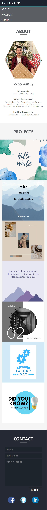
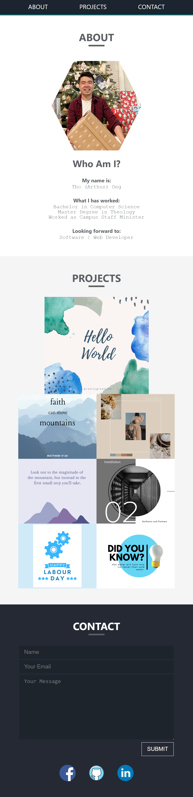
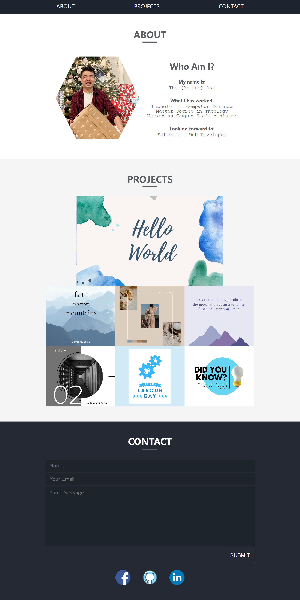

# w2c-portfolio-arthur

## About the Project
This is about Arthur's portfolio showing Arthur information, some works and how to contact Arthur.
> **version 1.0 :** In this very frst version of my portfolio, I am using -
> * html with semantic elements to building portfolio's structure
> * css with responsive adapting to different screen size
> * 'reset css' is reused, giving credit to 
        ```
        http://meyerweb.com/eric/tools/css/reset/ 
        ```
## Features
```
- When clicking to header navigations, page will be scrolled down to each its proper section
- Picture of author showed in a hexagon shape
- Applications showed by pictures with links to their GitHub Repos and Deployed Sites
- The first application image is bigger because it was my first project! Give it my heart <3
- There are 3 modes of screen for smartphone, tablet and desktop. The layout of the screen will be changed responsively.
- Mobile-First Approach used in css
```

## Deployment
Please follow [https://odthientho.github.io/w2c-portfolio-arthur](https://odthientho.github.io/w2c-portfolio-arthur/) to the deployed Arthur's portfolio.

## Screenshots

The following images showing application's deployment in different screen sizes.

### Mobile / Smartphone
>

### Tablet
>


### Desktop
>
